[toc]
# 数字电路
**特点：**

+ 稳定性高，抗干扰能力强
+ 易于设计，精度高
+ 便于大规模集成，批量生产，体积小，通用性好，成本低。
+ 可编程性，可实现硬件设计软件化
+ 高速度，低功耗
+ 便于存储、传输和处理
**数字量：**在时间上和数值上都是不连续的。（存在一个最小量化单位$\delta$）
**模拟量：**在时间上和数值上都是连续的

> 数字信号便于存储、分析和传输，通常都将模拟信号转换为数字信号  

**模拟电路与数字电路比较：**

+ 电路的特点：在模拟电路中，三极管或晶体管一般工作在线性放大区或恒流区；在数字电路中，三极管或晶体管工作在开关状态，即工作在饱和区或可变电阻区和截止区

+ 研究的内容：模拟电路主要研究：输入、输出信号间的大小、相位、失真等方面的关系。主要采用电路分析方法，动态性能用微变等效电路分析。数字电路主要研究：电路输出、输入间的逻辑关系。主要的分析工具是逻辑代数，电路的功能用真值表、功能表、逻辑表达式及波形图表示。

+ 基本元器件与基本电路不相同

**与模拟系统相比，数字系统有如下特点：**
（1）精度高 
模拟：元器件精度决定（电阻、电容）
数字：A/D位数，计算机字长，算法
（2）可靠性和可重复性高 
模拟：受温度、湿度、噪声、振动、电磁场干扰影响大
数字：可靠性和可重复性好
（3）灵活性大
模拟：修改硬件设计或调整硬件参数（模拟滤波器）
数字：改变软件设置（数字滤波器、自适应滤波器）
（4）易于大规模集成 
数字：数字部件规范，对电路参数要求不严
（5）可获得高性能指标、抗干扰强
（6）局限性
模拟：只有电路延时，处理是实时的
数字：按奈奎斯特定律，受采样保持电路、AD和处理速度的局限

******
## 一、数制和码值
1. 数字信号通常用数码形式表示，需要用进位计数制的方法组成多位数码使用。 
   **数制：**多位数码中每一位的构成方法以及从低位到高位的进位规则。数码形式表示数量的大小 。
   **码制：**编制代码所要遵循的规则。数码形式表示不同的事物或事物的不同状态。
   
2. **常用数制：**十进制（Decimal）、二进制（Binary）、八进制（O）、十六进制（Hexadecimal）
      对于n进制，其与十进制的转换都可以表示为$ (D)_N=({\sum{{\infty\atop {i=-\infty}}k_i\times10^i}})_D$
      
3. 若在数字电路中采用十进制，必须要有十个电路状态与十个记数码相对应。这样将在技术上带来许多困难，而且很不经济。
    **二进制的优点**：用电路的两个状态——开关来表示二进制数，数码的存储、分析和传输简单、可靠。
    **二进制的缺点**：位数较多，使用不便；不符合人们的习惯，输入时将十进制转换成二进制，运算结果输出时再转换成十进制数。

4. **不同进制之间的转换：**

   （1）二——十转换：二进制转十进制利用公式即可；十进制转二进制整数部分需要求二的余数直到余数为零或一，然后反序组合；当存在小数部分时，需要对小数部分不断乘二，然后取整数位，最后顺序组合。

   （2）二——十六转换：二进制化为十六进制先每四位化为一组，再按十进制进行计算，之后解的对应十六进制码；十六进制化二进制则直接将每一位十六进制数化为四位二进制即可。

   （3）二——八转换：八进制的每一位对应二进制的三位

   （4）十进制化为n进制：除权求余

5. **二进制算术运算：**

   （1）加法：与十进制类似，但要逢二进一

   （2）乘除：通过以为来实现，如左移扩大$2^n$倍，右移缩小$2^n$倍

   （3）减法：通过补码来实现

   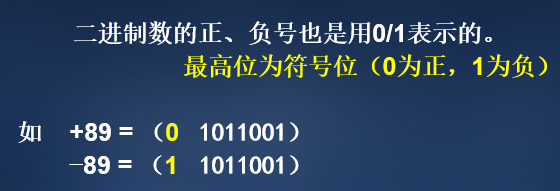

   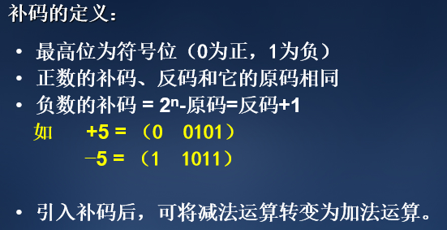

   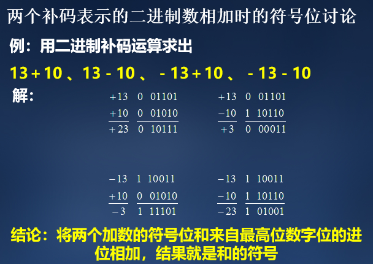

6. **常用码制：**

   （1）十进制代码：8421BCD码、余3码等，其中余3码相当于在8421的基础上加0011，余3循环码相当于格雷码0010——1010

   

   （2）格雷码

   特点：1.每一位的状态变化都按一定的顺序循环。
              2.编码顺序依次变化，按表中顺序变化时，相邻代码只有一位改变状态。
   应用：减少过渡噪声

   

   （3）美国信息交换标准代码（ASCⅡ）

     ASCⅡ是一组七位二进制代码，共128个

## 二、逻辑代数基础

1. **二值数字逻辑：**只有两种对立逻辑状态的逻辑关系。在二值逻辑中的变量取值：0/1， 0和1表示两个对立的逻辑状态。例如：电位的低高（0表示低电位，1表示高电位）、开关的开合等。
   逻辑：事物的因果关系
   
   **逻辑运算：**当两个二进制数码表示不同的逻辑状态时，它们之间可以按照指定的某种因果关系进行推理运算，称之为逻辑运算。

   **布尔代数：**进行逻辑运算的数学方法。

   **逻辑变量：**逻辑代数中用字母表示变量，称之为逻辑变量。

   数字电路要研究的是电路的输入输出之间的逻辑关系，所以数字电路又称逻辑电路，相应的研究工具是逻辑代数（布尔代数）。

2. **基本运算：**

   （1）与（AND）：决定事物结果的全部条件同时具备时，结果才会发生。
   $Y=A\quad AND \quad B=A\&B=A·B=AB$
   
   
   
   以A=1表示开关A合上，A=0表示开关A断开；以Y=1表示灯亮，Y=0表示灯不亮；
   
   (2)或（OR）：决定事物结果的全部条件之一具备，结果就会发生。
   $Y= A  \quad OR \quad B  =A|B= A+B$
   
   
   
   以A=1表示开关A合上，A=0表示开关A断开；以Y=1表示灯亮，Y=0表示灯不亮.
   
   （3）非（NOT）：决定事物结果的条件不具备，结果就会发生
   
   $ Y=A^{’}=NOT\quad A=\bar{A}$
   
   
   
   以A=1表示开关A合上，A=0表示开关A断开；以Y=1表示灯亮，Y=0表示灯不亮。
   
3. **常用复合逻辑运算：**

   （1）与非 $\quad Y=(A\cdot B)'$
   
   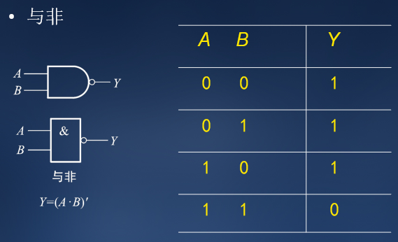
   
   （2）或非$\quad Y=(A+B)'$
   
   
   
   （3）与或非$\quad Y=(A\cdot B+C\cdot D)'$
   
   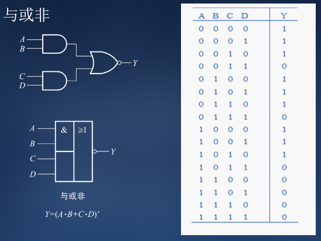
   
   （4）异或$\quad Y=A'B+AB'=A\bigoplus{B}$
   
   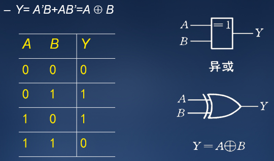
   
   （5）同或$\quad Y=A'B'+AB=A\bigodot B$
   
   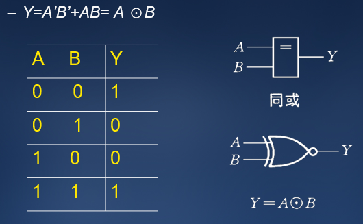
   
   > $A\bigodot B=(A\bigoplus B)'$
   
4. **逻辑代数的运算：**

   逻辑代数的基本运算：与、或、非；

   真值表：列出以0、1表示的逻辑关系的图表；

   门电路：能实现逻辑运算的单元电路；

   图形符号：标准认定的表示门电路的图形；

   复合逻辑运算：由与、或、非逻辑组合实现的逻辑运算，常见有与非、或非、与或非、同或、异或等。

   （1）基本公式：

   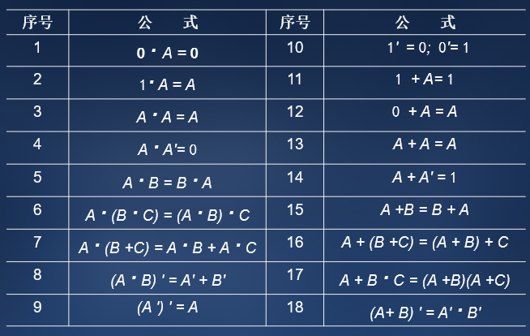

   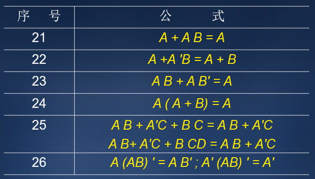

   （2）基本规则与定理

   + 吸收规则：吸收是指吸收多余（冗余）项，多余（冗余）因子被取消、去掉 ，包括正变量的吸收与反变量的吸收

   + 带入定理：在任何一个包含某变量A的逻辑等式中，若用另外一个函数代替等式两边出现的A，则等式依然成立。

   + 反演定理：根据摩根定理，对于任意一个逻辑式Y，若将其中所有的“·”换成“+”，“+”换成“·”，0换成1，1换成0，原变量换成非变量，非变量换成原变量，则得到的结果就是Y’。

     > 变换规则：
     >
     > （1）保持原来的运算优先级，即：先括号、然后乘、最后加；
     >
     > （2）不属于单个变量上的非号应保留不变。

   + 摩根定理：$A'\cdot B'=A'+B'\quad (A+B)'=A'\cdot B'$

     对于多变量同样适用。

   + 对偶定理：

     若两逻辑式相等，则它们的对偶式也相等。    

     > 对任意一个逻辑式Y，若将其中所有的“·”换成“+”，“+”换成“·”，0换成1，1换成0，得到的结果就是Y对偶式$Y_D$。

5. **逻辑函数的表达方法**

   （1）真值表

   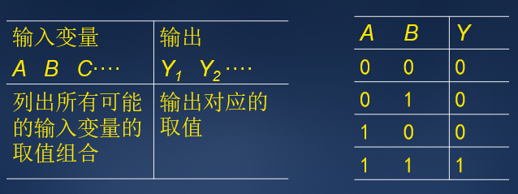

   （2）逻辑函数表达式

      将输入/输出之间的逻辑关系用与/或/非的运算式表示就得到逻辑函数式。

   > 标准形式：
   >
   > + 最小项之和：
   >
   >   *n*变量逻辑函数的最小项*m*：对于n变量函数有$2^n$个最小项
   >
   >   –*m*是包含*n*个因子的乘积项
   >
   >   –*n*个变量均以原变量和反变量的形式在*m*中出现一次
   >
   >   e.g：
   >
   >   + 两变量*A, B*的最小项：$A'B',\quad A'B,\quad AB',\quad AB(2^2=4个)$
   >
   >   + 三变量*A,B,C*的最小项：$A'B'C',\quad A'B'C,\quad A'BC',\quad A'BC,\quad AB'C',\quad AB'C,\quad ABC',\quad ABC(2^3=8个)$
   >
   >   编号：实质就是将非值取零，是值取一，求8421码十进制
   >
   >     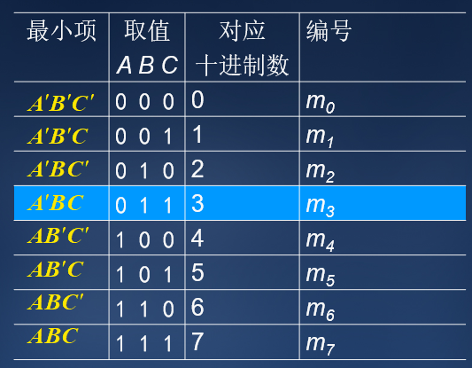 
   >
   >   性质：
   >
   >   + 在输入变量任一取值下，有且仅有一个最小项的值为1。
   >
   >   + 全体最小项之和为1。
   >
   >   + 任何两个最小项之积为0 。
   >
   >   + 两个相邻的最小项之和可以合并，消去一对因子，只留下公共因子。------相邻：仅一个变量不同的最小项，如：$A'BC'与A'BC$
   >
   >
   > + 最大项之积：
   >
   >   n变量逻辑函数的最大项M
   >   是包含n个因子的相加项；
   >   n个变量均以原变量和反变量的形式在M中出现一次。
   >
   >   两变量A, B的最大项
   >
   >   e.g: $A'+B',\quad A'+B,\quad A+B’,\quad A+B(2^2=4个)$ 
   >
   >   同样的，任意一个逻辑函数也都可以写成最大项之积的形式
   >   
   >   编号：非值取一，是值取零
   >   
   >   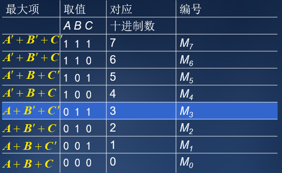
   >   
   >   性质：
   >   
   >   + 在输入变量任一取值下，有且仅有一个最大项的值为0；
   >   + 全体最大项之积为0；
   >   + 任何两个最大项之和为1；
   >   + 只有一个变量不同的最大项的乘积等于各相同变量之和;
   >   + 相同变量构成的最小项与最大项之间存在互补关系。从而，若已知函数的最大项表达式，由未出现在最大项表达式中的各标号组成的最小项之和就构成了最小项表达式，反之同理。
   >
   
   （3）逻辑图
   
      用逻辑图形符号表示逻辑运算关系，与逻辑电路的实现相对应。
   
   （4）波形图
   
      将输入变量的所有可能取值与对应输出按时间顺序排列起来画成时间波形。
   
   （5）卡诺图
   
   将逻辑函数的最小项之和以图形的方式表示出来。
   
   > 以$2^n$个小方块分别代表 *n* 变量的所有最小项，并将它们排列成矩阵，而且使几何位置相邻的两个最小项在逻辑上也是相邻的（只有一个变量不同），就得到表示*n*变量全部最小项的卡诺图。  
   >
   > 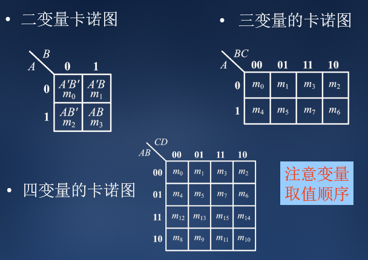
   >
   > 步骤：
   >
   > 1.将函数表示为最小项之和的形式$\sum m_i$；
   >
   > 2.在卡诺图上与这些最小项对应的位置上添入1，其余地方添0，当有无关项时，填入×。
   
   （6）硬件描述语言HDL
   
6. **表达方式的相互转换**

   （1）真值表——逻辑函数式

   + 真值表→表达式
     找出真值表中使 Y=1 的输入变量取值组合；
     每组输入变量取值对应一个乘积项，其中取值为1的写原变量，取值为0的写反变量；
     将这些变量相加即得 Y。

   + 表达式→真值表
     把输入变量取值的所有组合逐个代入逻辑式中
     求出Y值，列表即可。

   （2）逻辑函数式——逻辑图

   + 逻辑函数式→逻辑图
      用图形符号代替逻辑函数式中的逻辑运算符。一般从括号里往外画

   + 逻辑图→逻辑函数式
     从输入到输出逐级写出每个图形符号对应的逻辑函数式。

   （3）真值表——波形图

   按顺序画即可 

7. **逻辑函数的化简**

   > 逻辑函数的最简形式——最简与或式：包含的乘积项最少，每个乘积项的因子也最少，称为最简的与或逻辑式。

   （1）公式化简法

   （2）卡诺图化简法

   + 依据：具有逻辑相邻性的最小项相加合并，可以消去有关变量因子。

   + 在卡诺图中，最小项的相邻性可以从图形中直观地反映出来。即：几何相邻的最小项在逻辑上也具有相邻性。

   + 原则：

     + 包围圈内的方格数必定是$2^n$个。化简后的乘积项应包含函数式的所有最小项，即覆盖图中所有的1，或者说图中的每一个1都要被圈到。

     + 相邻方格包括上下底相邻，左右边相邻和四个角相邻。同一方格可以被不同的包围圈重复包围，但新增包围圈中一定要有新的方格。

     + 每个乘积项因子最少，即圈成的矩形最大。乘积项的数目最少，即圈成的矩形最少。

   + 化简步骤：
        ------用卡诺图表示逻辑函数
        ------找出可合并的最小项
        ------化简后的乘积项相加（项数最少，每项因子最少）
   
8. **具有无关项的逻辑函数及其化简**

   （1）约束项、任意项和逻辑函数式中的无关项

   逻辑函数中的无关项：约束项和任意项可以写入函数式，也可不写入函数式，因此统称为无关项。

   + 在逻辑函数中，对输入变量取值的限制，在这些取值下为1的最小项称为约束项。
   
   + 在输入变量某些取值下，函数值为1或为0不影响逻辑电路的功能，在这些取值下为1的最小项称为任意项。
   
   （2）应用
   
   + 合理地利用无关项，可得更简单的化简结果。
   
   + 加入（或去掉）无关项，应使化简后的项数最少，每项因子最少······
     从卡诺图上直观地看，加入无关项的目的是为矩形圈最大，矩形组合数最少。
     
   + 要注意的是，圈要包含$2^n$个数字，即1或者无关项

8. **不同逻辑表达式之间的转换**

   合理利用$Y=(Y')'$即可

   与或式→与非与非式
   与或式→或非或非式
   与或式→与或非式

## 三、门电路
1. **门电路：**实现基本和常用逻辑运算的单元电路。如与门、或门、非门、或非门······
   主要分为两大类：TTL门电路和CMOS门电路

   门电路中以高/低电平表示逻辑状态的1/0。
   
2. **获得高、低电平的基本原理：**利用开关电路

   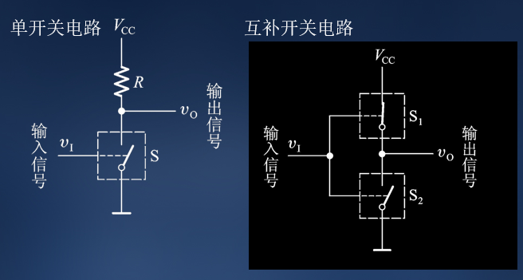

3. **逻辑电平的定义方法：**（都允许有一定的变化范围）

   正逻辑：高电平表示1，低电平表示0

   负逻辑：高电平表示0，低电平表示1

4. **分类：**

   + 从制造工艺上将数字集成电路分为MOS型、双极型和混合型三种；
   + 从集成度上可分为： SSI、MSI、LSI 、VLSI等类型；
   + 门电路分类：TTL门电路、CMOS门电路
     基本原理：基于二极管、三极管的开关特性。

5. **半导体二极管门电路**

   (1)二极管的开关特性

   + 单向导电性

     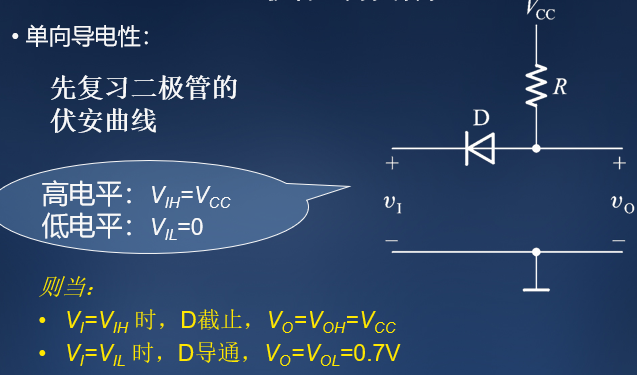

     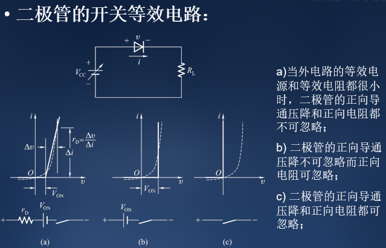

   + 反向恢复时间

     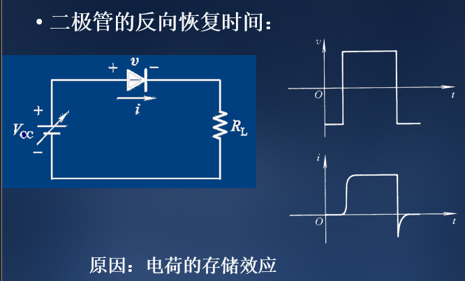

   (2)二极管与门

   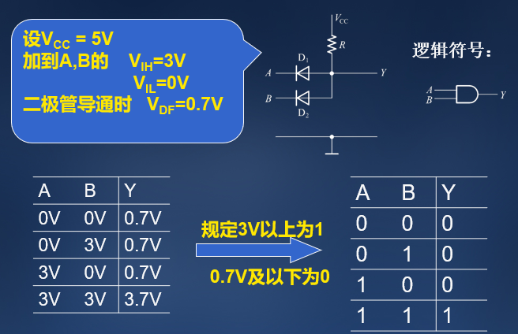

   (3)二极管或门

   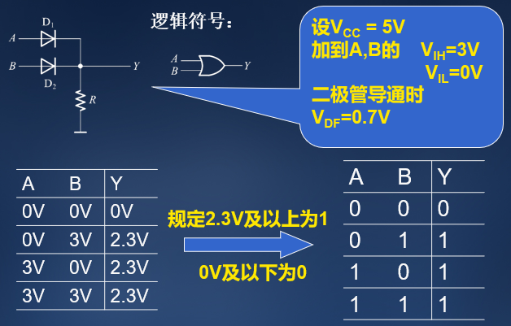

6. **CMOS门电路**

   (1)MOS管的结构

   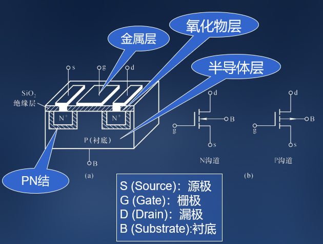

   (2)MOS管的原理

   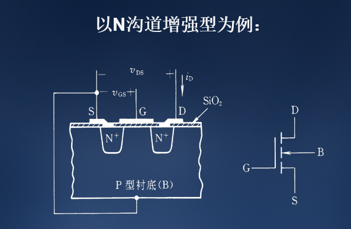

   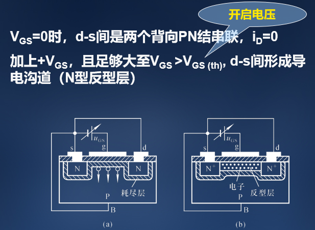

   

   (3)MOS管的输出特性

   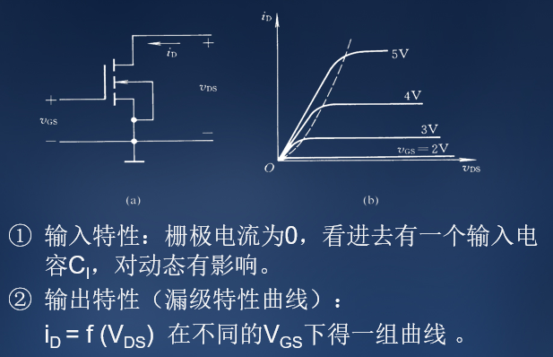

   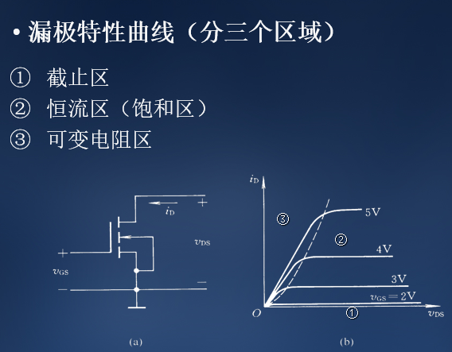

   

   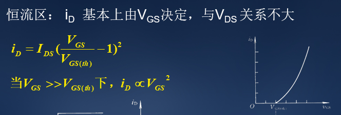

   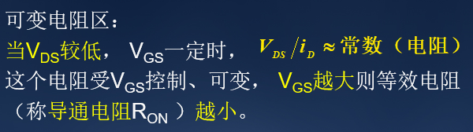

   (4)MOS管基本开关电路

   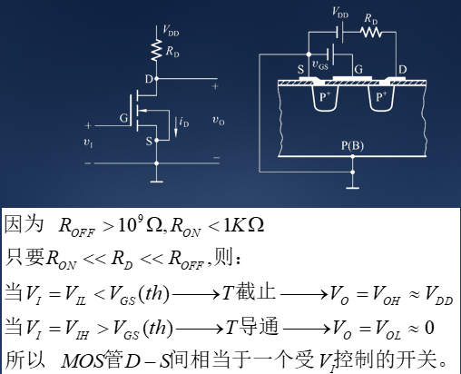

   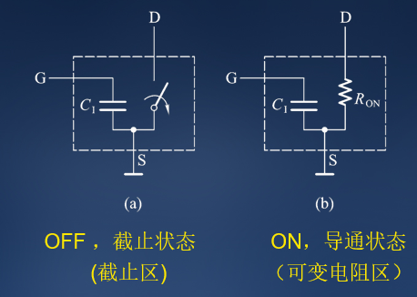

   (5)MOS管的四种基本类型

   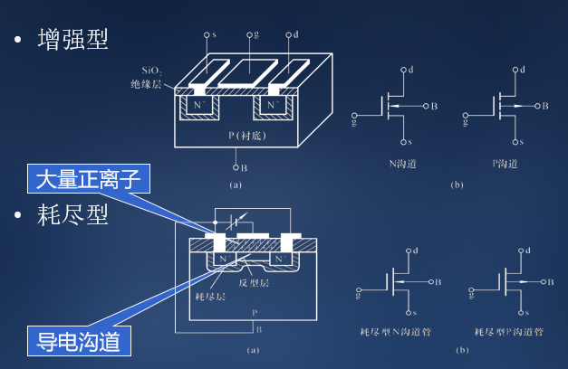

7. **CMOS反相器的电路结构和工作原理**

   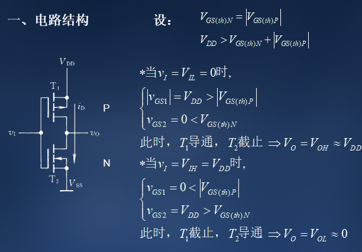

   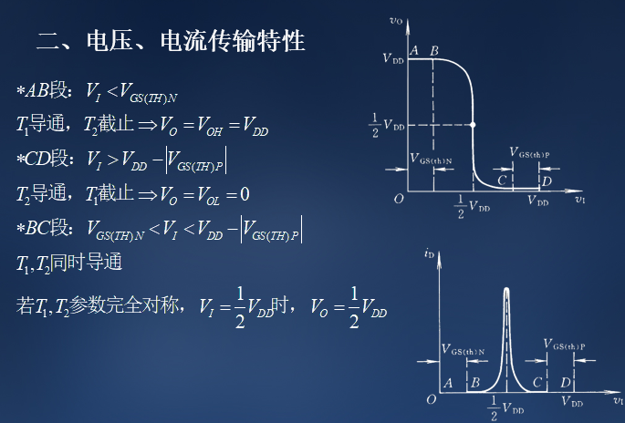

   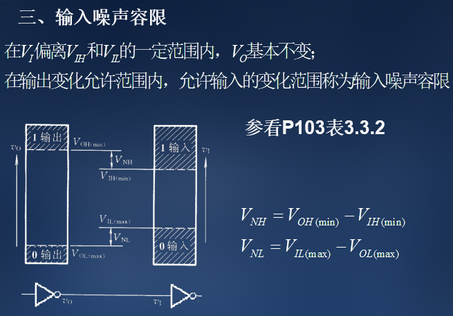

   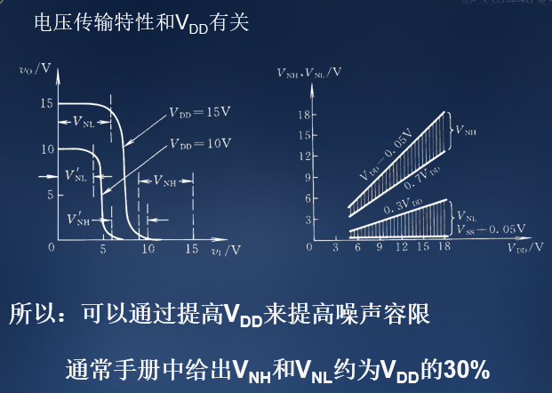

   (1)CMOS 反相器的静态输入和输出特性

   

   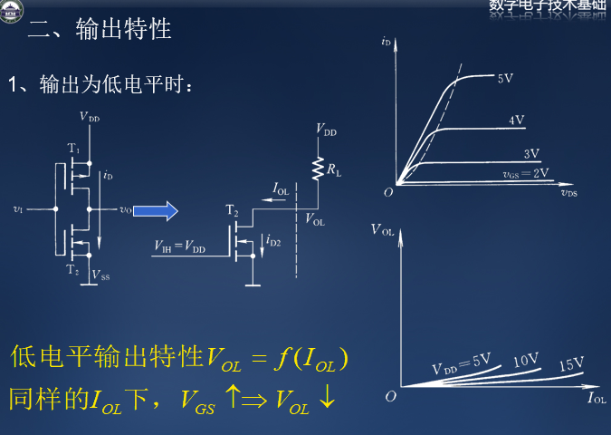

   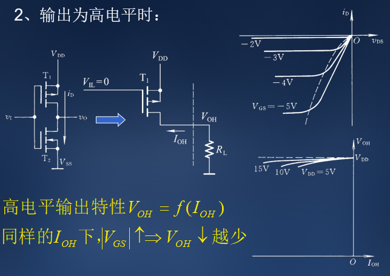

   (2)CMOS反相器的动态特性

   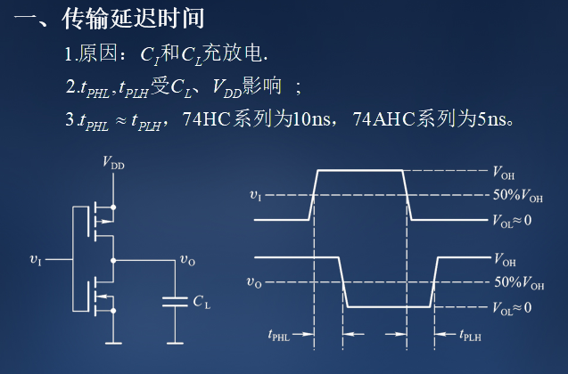

   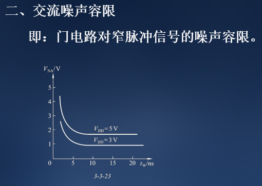

   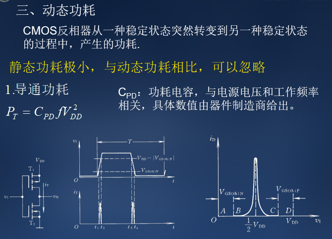

   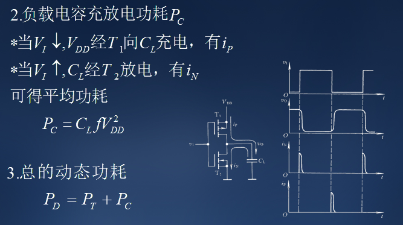

8. **其他类型的CMOS门电路**

   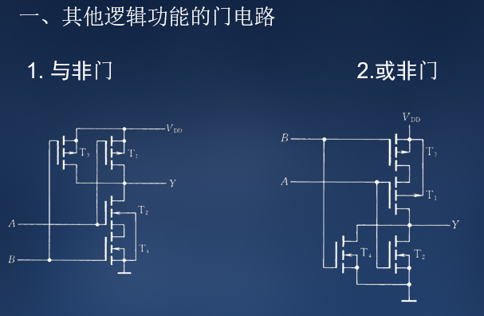

   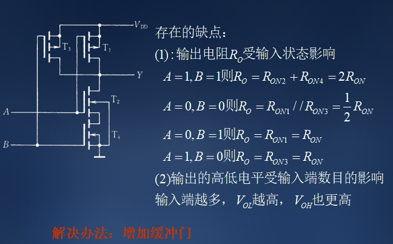

   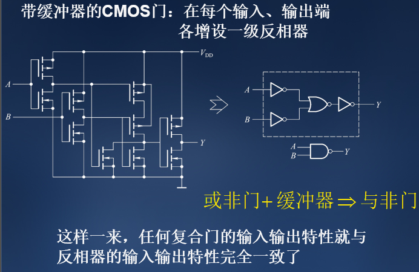

   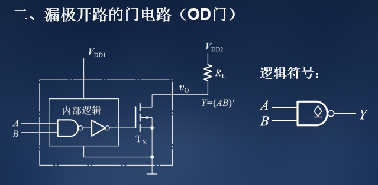

   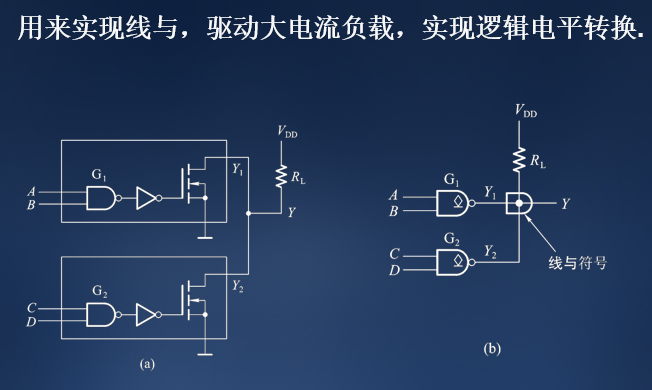

   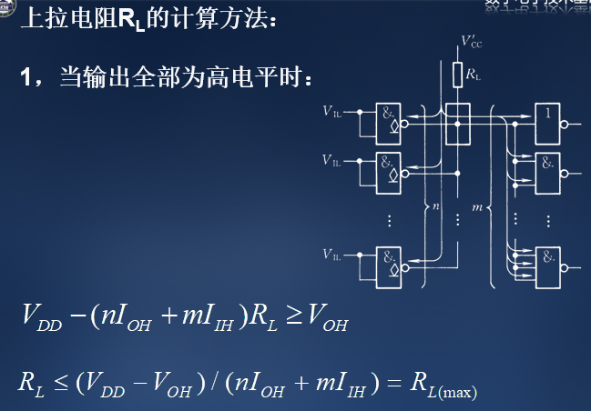

   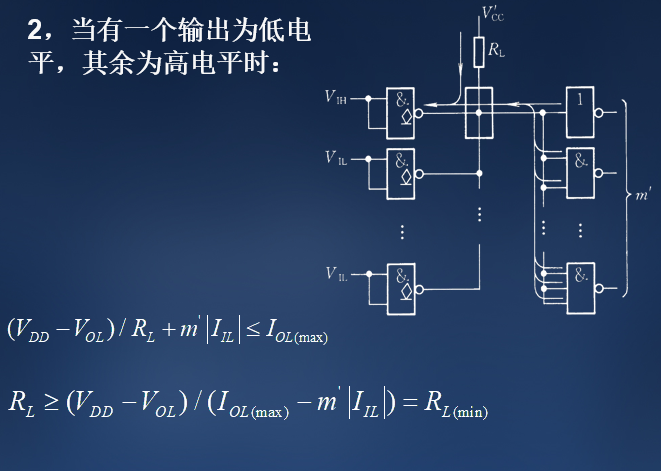

   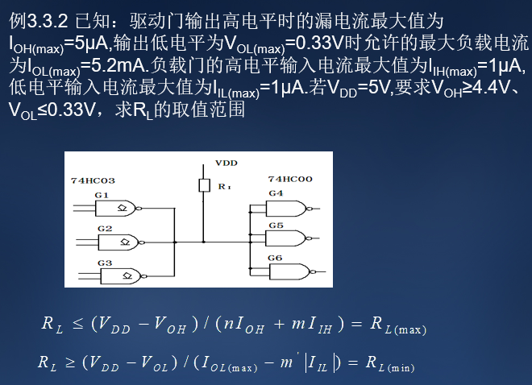

   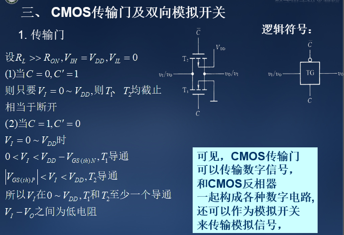

   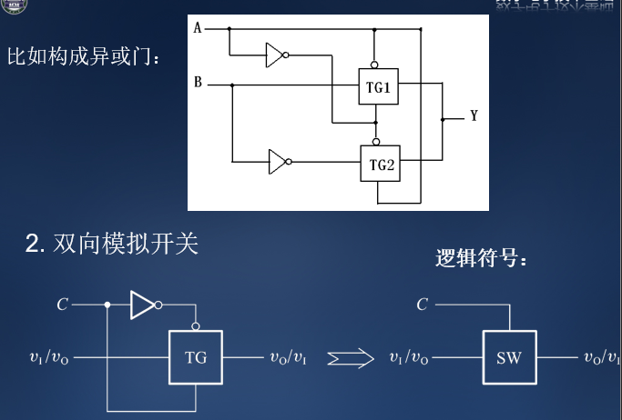

   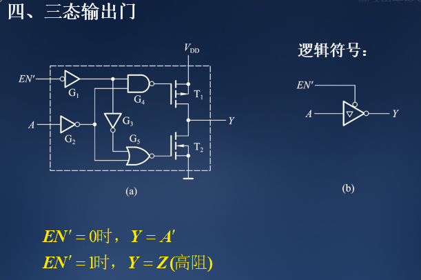

   

9. TTL门电路（自学）

## 四、组合逻辑电路

1. **特点：**

   (1)功能上，任意时刻的输出仅取决于该时刻的输入

   (2)电路结构上，不含记忆功能（存储）元件，没有延迟通路

2. **逻辑功能的描述**

   

3. **组合逻辑电路的分析方法**

   从电路的输入到输出逐级写出逻辑函数式，最后得到表示输出与输入之间的逻辑函数式；将该函数式进行化简和变换；为了使电路的逻辑功能更加直观，还应将逻辑函数式转换为真值表；确定逻辑电路的功能

4. **组合逻辑电路的设计方法**

   （1）逻辑抽象：分析因果关系，确定输入/输出变量及表示符号、定义逻辑状态的含意（赋值）、列出真值表
   （2）写出逻辑表达式
   （3）选定器件类型
   （4）根据所选器件：对逻辑式化简、对逻辑式进行变换、进行相应的描述
   （5）画出逻辑电路图，或下载到PLD
   （6）工艺设计（专门课程）

5. **常用组合逻辑电路**

   （1）编码器：

   编码：用一个二进制代码表示特定含义的信息
   编码器：具有编码功能的逻辑电路

   + 普通编码器

     特点：任何时刻只允许一个输入信号有效。

     e.g: 3位二进制普通编码器

     

     

   + 优先编码器

     特点：允许同时输入两个以上的编码信号，但只对其中优先权最高的一个进行编码。

     e.g: 8线-3线优先编码器
     
     
     
     
     
   + 编码器的拓展

     e.g: 2片8线-3线优先编码器合成16线-4线优先编码器

     

     高位借GS口，GS口需输出为高位，其余对应相连。

   （2）译码器

   译码：将具有特定含义的二进制码转换成对应的输出信号。
   常用的有：二进制译码器，二-十进制译码器，七段显示译码器等

   + 二极管实现

   

   + 逻辑门实现

     

     

   + 二-十进制译码器

     将输入BCD码的10个代码译成10个高、低电平的输出信号。

     BCD码以外的伪码，输出均无低电平信号产生

   + 用译码器设计组合逻辑电路

     （1）基本原理：3位二进制译码器给出3变量的全部最小项;
     	                       。。。
     	                       n位二进制译码器给出n变量的全部最小项;任意函数
     
     任意函数则将n位二进制译码输出的最小项组合起来，可获得任何形式的输入变量不大于n的组合函数$Y=\sum m_i$
     
     
     
   + 译码器构成数据分配器，译码器产生顺序脉冲

     

   + 显示译码器

     能将数字或符号的代码译出，并能驱动显示器件显示出原来的数字或符号的电路。

     （1）七段字符显示器

     

     

   + 共阴极接法

   + 共阳极接法

   （3）数据选择器

   经过选择，把多路数据中的某一路数据传送到公共数据线上，实现数据选择功能的逻辑电路。

   

   

   

   （4）加法器

   + 1位加法器

     半加：不考虑来自低位的进位，将两个1位的二进制数相加

     

   + 全加器

     全加：将两个1位二进制数及来自低位的进位相加

     

   + 多位加法器

     （1）串行进位加法器

     

     （2）超前进位加法器

     

     （3）用加法器设计组合电路

     基本原理：若要产生的逻辑函数可变换成输入变量与输入变量相加;或者可变换成输入变量与常量相加.

     

     

   + 利用加法器实现减法运算

     

     

   （5）数值比较器

   用来比较两个二进制数的数值大小

   + 1位数值比较器

     

   + 多位数值比较器

     见下页，从高位比起，只有高位相等，才比较下一位。

     

     

     

     

     

6. **组合逻辑电路中的竞争-冒险现象**

   （1）现象及成因

   由于信号的传输途径不同和门的传输延迟时间不等，以致当一个门的两个输入信号同时向相反方向转换时，就可能会出现竞争冒险。

   （2）概念

   一个逻辑门的两个输入“同时向相反的逻辑电平变化”，而变化的时间有差异的现象，称存在“竞争”。因“竞争”而可能在输出产生干扰脉冲的现象，称“冒险”。

   （3）2线—4线译码器中的竞争-冒险现象

   

   （4）消除方法

   + 接入滤波电容(几十到几百皮法)

   + 引入选通脉冲：取选通脉冲作用时间，在电路达到稳定之后，P的高电平期的输出信号不会出现尖峰。

     

   + 修改逻辑设计

     

## 五、触发器

1. **基本双稳态电路**

   

   功能：用于记忆1位二进制信号
   
   + 有两个能自行保持的状态
   + 根据输入信号可以置成0或1

2. **触发器分类**
   
   + 按触发方式（电平，脉冲，边沿）
   + 按逻辑功能（SR, JK, D, T）
   
3. **锁存器**

   锁存器是一种对脉冲电平敏感的双稳态电路，是构成各种触发器的基本单元电路

   （1）SR锁存器

   

   + 工作原理
     两个或非门接成反馈，引出输入端用来置0,1

     定义：Q=1，Q'=0为“1”状态；Q=0，Q'=1为“0”状态

     $R_D$为置0输入端，$S_D$为置1输入端
     根据工作原理得到真值表，$S_D$和$Q_D$的“1”信号同时消失后，$Q^*$不定所以正常工作下，应遵循$S_DR_D=0$的约束条件。

     

   + 原理图

     
     
     
     
   + 用与非门构成的基本SR锁存器

     

     

   （2）D锁存器

   

4. **电平触发的锁存器**

   

   

   

   

5. **触发器**

   （1）触发：对时钟脉冲边沿敏感的状态更新
   （2）触发器：具有触发工作特性的存储单元

   （3）分类：主从触发、维持阻塞触发、利用传输延迟触发

   （4）主从触发器

   

   

   

   

   

   （5）边沿触发

   为了提高可靠性，增强抗干扰能力，希望触发器的次态仅取决于CLK的下降沿（或上升沿）到来时的输入信号状态，与在此前、后输入的状态没有关系。

   e.g: 用CMOS传输门的边沿触发器、维持阻塞触发器、用门电路tpd的边沿触发器

   

   

   

   

6. **常用触发器**

   （1）SR触发器

   

   

   （2）JK触发器

   

   （3）T触发器

   

   （4）D触发器

   

7. **触发器的转换**

   

   

   

## 六、时序逻辑电路

1.**时序逻辑电路的特点：**

+ 功能上：任一时刻的输出不仅取决于该时刻的输入，还与电路原来的状态有关。

+ 电路结构上：

  （1）包含存储电路和组合电路

  （2）存储器状态和输入变量共同决定输出

  （3）时序电路的状态与时间因素相关
2. **时序电路的一般结构形式与功能描述方法**

   

   

3. **时序电路的分类**

   + 同步时序电路与异步时序电路
     同步：存储电路中所有触发器的时钟使用统一的clk，状态变化发生在同一时刻
     异步：没有统一的clk，触发器状态的变化有先有后
   + Mealy型和Moore型
     Mealy型：$Y=F(X,Q)$ 与X、Q有关  
     Moore型：$Y=F(Q)$仅取决于电路状态                      

4. **时序逻辑电路的功能表达**

   1、逻辑方程组
   2、转换表
   3、状态表
   4、状态图

   

   5、时序图
   6、HDL语言

5. **同步时序电路的分析方法**

   （1）分析：找出给定时序电路的逻辑功能即找出在输入和CLK作用下，电路的次态和输出。
   （2）一般步骤：
   ①从给定电路写出存储电路中每个触发器的驱动方程（输入的逻辑式），得到整个电路的驱动方程。
   ②将驱动方程代入触发器的特性方程，得到状态方程。
   ③从给定电路写出输出方程。
   ④列出转换表。
   ⑤画出状态图和时序图。
   ⑥分析逻辑功能。

6. **异步时序电路的分析方法**

   

   

6. **同步时序逻辑电路的设计方法**

   设计的一般步骤：
   （1）逻辑抽象，建立原始状态图和原始状态表

   1.   确定输入/输出变量的数目和名称；
   2.  找出所有可能的状态以及状态转换之间的关系和输入条件，建立原始状态图。
   3.  根据原始状态图建立原始状态表。

   （2）状态化简：若两个状态在相同的输入下有相同的输出，并转换到同一个次态，则称为等价状态；等价状态可以合并。

   （3）状态分配（编码）

   + 确定状态编码的位数与触发器数目N。N与状态数M满足:$M≤ 2^N$；
   + 给每个状态规定一个编码；
   + 依据状态表得到转换表；

   （4）选定触发器类型
   （5）确定激励方程组和输出方程组

   （6）画出逻辑图，并检查自校正能力

   

7. 自校正的意义：

   （1）为什么需要自校正：设计中会出现没有用到的无效状态。当电路上电后可能陷入这些无效状态而不能退出。因此需要检查电路是否能进入有效状态。

   （2）如何检查自校正：列出所有的无效状态。分别以它们作为现态，代入电路的转换方程组求其次态。如果还没有进入有效状态，再以新的状态作为现态求一个次态，以此类推，检查最终能否进入有效状态。

   （3）若不能自校正，如何修改电路：在激励信号卡诺图的包围圈中，对无关项X的处理做适当修改（原来取1圈入包围圈的，改成取0而不圈入包围圈），得到新的激励方程组和逻辑图，然后再检查，直到能自校正为止。

9. **若干典型的时序逻辑电路**

   （1）寄存器和移位寄存器

   + 寄存器
     ①用于寄存一组二进制数据，N位寄存器由N个触发器组成，可存放一组N位二进制数据。
     ②只要求其中每个触发器可置1，置0。

   

   + 移位寄存器（代码在寄存器中左/右移动）：具有存储 + 移位功能

     
     
   + 多功能双向移位寄存器

     

   （2）计数器

   + 用于计数、分频、定时、产生节拍脉冲等

   + 分类：按时钟分：同步、异步；
     		   按计数过程中数值增减分：递增、递减和可逆；
             		按计数器中的数值编码分：二进制、BCD和循环码…
               	   按计数容量分：十进制，六十进制…

   + 计数器的模：计数器从某一状态开始依次遍历不重复的各个状态后完成一次循环，所经历的状态总数

   + 同步二进制计数器

     ①同步二进制加法计数器

     原理：根据二进制加法运算规则可知：在多位二进制数末位加1，若第i位以下皆为1时，则第i位应翻转。

     

     
     
     ②同步二进制减法计数器
     原理：根据二进制减法运算规则可知：在多位二进制数末位减1，若第i位以下皆为0时，则第i位应翻转。

     
     
     
     
     ③同步加减计数器

2. 

## 七、半导体存储器

  能存储大量二值数据的器件，属于大规模集成电路

1. 一般结构形式：

   

2. 分类：

   （1）从存/取功能分：

   + 只读存储器(Read-Only-Memory)：长久保存

     掩膜ROM、可编程ROM、可擦除可编程EPROM

   + 随机存取存储器(Random-Access-Memory)：断电后数据丢失

     静态RAM、动态RAM

   （2）从工艺分：

   + 双极型
   
   + MOS型
   
3. ROM

   

   

   

   存储单元数=字数*位数

   地址码的位数n（地址线数）与字数N的关系为：$N=2^n$

   数据线根数=数据位数=位数

   最高地址=字数+起始地址-1

   例如，PPT中的存储器容量为16*4

   + 掩模ROM的特点：出厂时已经固定，不能更改，适合大量生产，简单，便宜，非易失性
   + 可编程ROM（PROM）：一次性编程

4. RAM

   

   

5. 存储器容量的拓展

   （1）位扩展方式

   

   需要字数比

   （2）字拓展方式

   

   需要位数比

   

6. 用存储器实现组合逻辑函数

   

   

## 八、可编程逻辑器件（PLD, Programmable Logic Device）

1. 概述：可编程逻辑器件 ( Programmable Logic Device ) ,简称PLD，是一种通用大规模集成电路，用于LSI和VLSI设计中，采用软件和硬件相结合的方法设计所需功能的数字系统。

   （1）数字集成电路从功能上可分为通用型、专用型两大类

   （2）PLD的特点：是一种按通用器件来生产，但逻辑功能是由用户通过对器件编程来设定

2. PLD的发展和分类
   （1）按照门电路的集成度分类：低密度和高密度器件

   （2）发展：

   ​        PROM是最早的PLD
   ​        PAL   可编程阵列逻辑
   ​        FPLA  现场可编程逻辑阵列
   ​        GAL 通用阵列逻辑
   ​        EPLD 可擦除的可编程逻辑器件
   ​        FPGA 现场可编程门阵列
   ​        ISP-PLD 在系统可编程的PLD

3. PLD中的电路逻辑符号

   

## 九、硬件描述语言简介

1. **什么是Verilog HDL？**

   能够对数字逻辑电路的功能和结构进行描述的一种高级编程语言
   PLD/FPGA的设计开发语言
   编写程序描述数字电路的功能与结构
   描述电路的功能
   描述电路的结构
   表达具有并行性

2. **Verilog HDL特点**

   

3. **Verilog HDL程序结构**

   

   

   

   

   

   

   

   

   

4. **Verilog HDL语言要素**

   

   

5. **Verilog HDL常量和变量**

   

6. **Verilog HDL语言表达式**

   

   

   

7. **Verilog HDL行为描述语句**

   

8. **Verilog HDL过程语句**

   

   

   

   

9. **Verilog HDL语句块**

   

   

   

   

   

   

   

   

   

   

   

   

   

## 十、脉冲波形的产生和整形

1. **获取矩形脉冲的方法**

   （1）脉冲波形发生电路直接产生

   （2）将已有信号通过波形变换电路获得

2. **描述矩形脉冲特性的主要参数**

   

3. **单稳态触发器**

   （1）特点：
   ①有一个稳态和一个暂稳态。
   ②在外界触发信号作用下，能从稳态→暂稳态，维持一段时间后自动返回稳态。
   ③暂稳态维持的时间长短取决于电路内部参数。

   单稳态触发器的应用：定时，延时，噪声消除电路

   （2）用门电路组成的单稳态触发器

   

   

   

   

   

   

   （3）集成单稳态触发器

   

4. **施密特触发器**

   

   

   

   

   施密特触发器的主要特点：输入信号在上升和下降过程中，电路状态转换的输入
   电平不同；电路状态转换时有正反馈过程，使输出波形边沿变陡

   施密特触发器的应用：用于波形变换；用于鉴幅；用于脉冲整形

5. 多谐振荡器

   （1）对称式多谐振荡器

   

   

   

   （2）非对称式多谐振荡器

   

   

6. 环形振荡器

   

   

   

## 十一、数-模和模-数转换

1. **用途：**

   

2. **分类：**

   

   输入/输出方式：并行、串行

3. **D/A转换器**

   

   由数字信号（01）转换为模拟信号（电压或电流）

   （1）权电阻网络D/A转换器

   
   
   
   
   
   
   （2）倒T形电阻网络DAC
   
   
   
   
   
   
   
   
   
   （3）具有双极性输出的DAC
   
   当输入数字量有±极性时，希望输出的模拟电压也对应为±。
   
   
   
   + DAC的转换精度与速度
   
     【1】转换精度
   
     + 分辨率（理论精度）：用输入数字量的二进制数码位数给出
   
       n位DAC,应能输出$0\to 2^{n-1}$个不同的等级电压，区分出输入的00···0到11···1， $2^n$个不同状态
   
     + 转换误差（实际精度）：表示实际的D/A转换特性和理想转换特性之间的最大偏差.
       一般用最低有效位的倍数来表示,比如1/2LSB。表示输出模拟电压与理论电压值之间的绝对误差小于等于当输入为00…..01时的输出电压的一半。
       有时也用绝对误差与输出电压满刻度的百分数来表示。
   
     【2】误差分析
     
     
     
     
     
     
   
4. **A/D转换器**

   

   由模拟信号（电压或电流）转换为数字信号（01）

   

习题：


