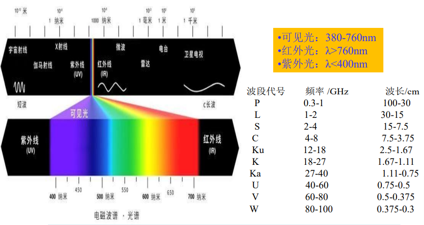
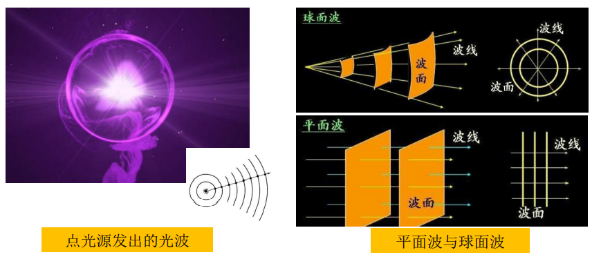
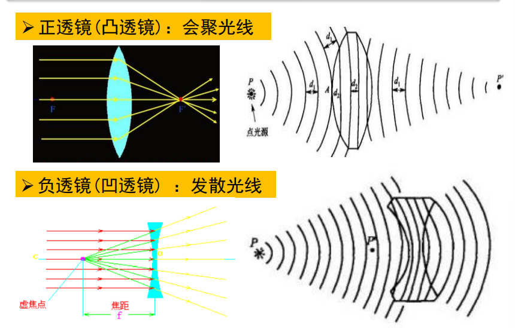
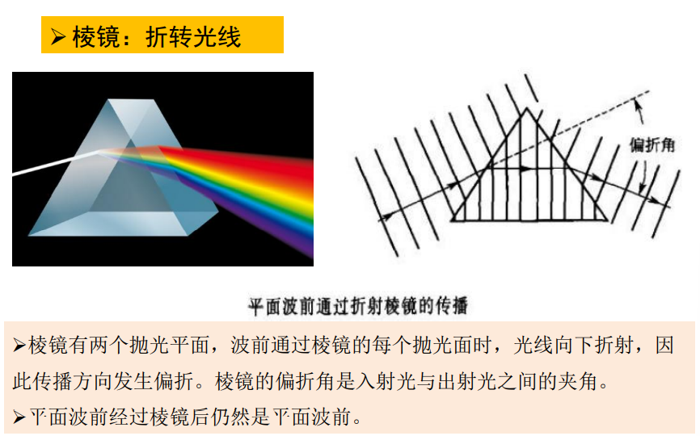
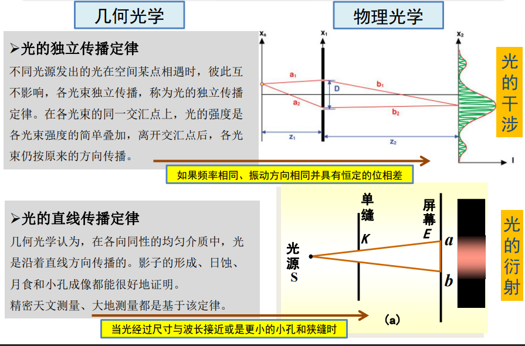

[toc]

# 工程光学

## 光学基础知识

1. 光的发展史

+ 光学，物理学的一个重要分支，它是一门既古老又充满活力的学科。 一般认为对“光”的研究最早的文字记载是公元前 323-385年古希腊人“欧几里德”对“人为什么能看见周 围物体”的描述，在欧几里德的描述中已经提出了光的直 线传播性。 但实际上对“光”研究最早的应该是我国先秦时代， 约公元前400年-470年的“墨经” 。墨经中对光的几何性 质作了较完整的记载。包括“光”与“影” ，直线传播及针孔成像，光的反射及平面、球面反射镜。
+ 其中有重要意义的事件有：公元1100年阿拉伯人阿尔-海兹恩（Al-hazen）发明了第一个透镜。1590年琼森和李普塞（Jonsen and Lippershey）发明了第一台望远 镜。17世纪初冯特纳（Fontana）发明了第一台显微镜。17世纪上半叶，斯涅耳和笛卡尔（Snell and Descarte）提出了折 射与反射定律。 说明到17世纪上半叶，有关光的几何性质已基本清楚。 从17世纪后半 叶，牛顿和惠更斯（Newton and Huggens）分别提出了微粒说与波动说。 同时，1665年牛顿的太阳光实验首次 揭示光谱，发现了牛顿环。
+ 从17世纪上半叶到19世纪上半叶的两个世纪中，牛顿的微粒说与惠更斯的 波动说一直并存，而且在17世纪上半叶到18世纪上半叶微粒说一直占据优势。 牛顿的微粒说认为光是一种微粒流，它成功的解释了光的直线传播以及折射、 反射，但是无法解释光的干涉、衍射及偏振。同时应该提出的是牛顿的微粒说 与现在光量子是有本质区别的，牛顿提出的微粒是倾向于一种“机械弹性小球” 。惠更斯极力反对微粒说，1690年他创立了波动论，但是惠更斯当时提出的 波动论也不同于我们现在理论的电磁波理论。 惠更斯认为光波与声波一样是一 种机械波，而机械波的传播必 须要有传播介质，光在真空中也能传播。为了解 释波动论，惠更斯提出了“以太” ，认为光是在“以太”中传播的弹性脉动， 认为这种“以太”充满整个宇宙的全部空间，但是科学家始终 没有找到这种 “以太” ，所以又提出了“以太”的密度非常小， 而弹性模量非常大的假设。 惠更斯的波动说倾向于机械波。
+ 直到1860年（19世纪下半叶），麦克斯韦在前人工作的 基础上提出了 光是一种电磁波，1888年又被赫兹（Herty）用实验证明。按照麦克斯韦电 磁理论求得的电磁波在真空中 的速度正好等于光在真空中的速度。在电磁 波理论中以交变电磁场作为传播介质。从麦克斯韦电磁方程，施加某些边 界 条件，就可以推出“波动方程” ，它科学地解释了光的传播定律，解释 了干涉、衍射、偏振等现象。发展为物理光学一 门独立的学科，而几何光 学是物理光学中当波长趋向于零时的一级近似。 1905年爱因斯坦根据普朗克理论，成功的解释了光-粒子能量转 换方 面的很多现象，其中最重要的是光电效应和光化学方面的基本规律，从而 确立了光量子理论。 到目前为止，我们只能承认光的电磁波理论与光的量子理论两者同时 有效，即光的波粒二象性。

2. 电磁光谱

   电磁波谱范围从宇宙射线到无线电波，波长范围非常宽，辐射特性也非常广。γ射线的波长小于亿分之一微米，无线电波的波长则以千米计量。

   电磁波谱的可见光光谱区只是其中很小的一部分。

   在可见光范围内，太阳光可分解为红、橙、黄、绿、青、蓝、紫(波长由长到短排列)等七种颜色的光。

   

3. 为什么天空是蓝色的？ 

   当太阳光通过空气时，波长较长的红色光透射力最大（其次是橙、 黄色光），它能透过大气中的微粒射向地面；而波长较短的蓝、紫、青 等色光，很容易被悬浮在空气中的微粒散射开，使天空呈现蓝色。

   为什么大海是蓝色的？

    当太阳光照射到大海上，红光、橙光这些波长较长的光，能绕过一 切阻碍，勇往直前。 它们在前进的过程中，不断被海水和海里的生物所 吸收。而像蓝光、紫光这些波长较短的光，虽然也有一部分被海水和海 藻等吸收，但是大部分一遇到海水的阻碍就纷纷散射到周围去了，或者干脆被反射回来了。我们看到的就是这部分被散射或被反射出来的光。

4. 光波的传播

   从物理学的角度看，辐射光能的物体称为发光体，或称为光源。 真空中点光源发出的光波在任一时刻的波前形状都是球面，随着波前传播远离点源，其曲率（半径的倒数）在减小。在一个足够远的距离上，波前半径可以看作无穷大，这种波前认为是平面波。

   

5. 简单透镜和棱镜对波前的作用

   

   

6. Snell折射定律

   现在讨论一束平面波，入射在一个平的表面上，平面两侧是两种不同的介质。 令上侧介质的折射率是$n_1$，下侧介质的折射率是$n_2$。在时刻$t_0$，波前与界面交于A点， 在$t_1=t_0+Δt$时刻，与界面交于B点。在这段时间内，光线在上侧介质中的传播距离是：$d_1=v_1\Delta{t}=\frac{c}{n_1}\Delta{t}$，在下侧介质中传播的距离是：$d_2=v_2\Delta{t}=\frac{c}{n_2}\Delta{t}$

   > 折射率：用来描述介质中的光速相对于真空中的光速减慢程度的物理量。$n=\frac{c}{v}$，n为折射率，c为真空中光的传播速度，v为不同介质中光的传播速度。真空中的折射率为1，$c=3×10^8m/s$

   当一束光（入射光）投射到两种均匀介质的光滑分界表面时，一部分光从光滑分界表面“反射”回原介质$n_1$中，这种现象称为光的反射，反射回原介质$n_1$的光称为反射光；另一部分光将“透过”光滑表面，进入第二种介质$n_2$ ，这种现象称为光的折射， 透过光滑表面进入第二种介质的光称为折射光。

   

7. 光的干涉和衍射

   

   + 光的干涉

     

   + 光的衍射

7. 